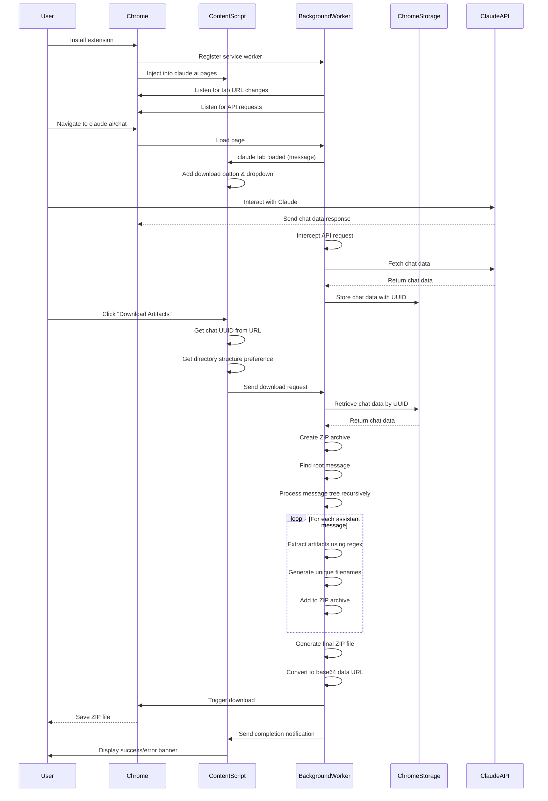

# Claude Artifact Downloader - Sequence Diagram
> current

## Diagram Explanation

This sequence diagram illustrates the complete lifecycle of the Claude Artifact Downloader extension, from installation through to artifact download. Key phases include:

1. **Installation and Initialization**: Extension setup in Chrome
2. **Page Load and UI Setup**: Content script adds UI elements to Claude interface; Background worker listens for tab load and claude chat requests
3. **Chat Data Monitoring**: Background worker intercepts and stores Claude API responses
4. **User Interaction**: User triggers download through UI
5. **Artifact Processing**: Background worker processes chat data to extract artifacts
6. **Download Generation**: ZIP file is created and downloaded

The diagram shows interactions between:
- User
- Chrome browser
- Content script (running in Claude web page)
- Background service worker
- Chrome storage API
- Claude API

This represents the current implementation without the planned enhancements for new content types and improved UI. 